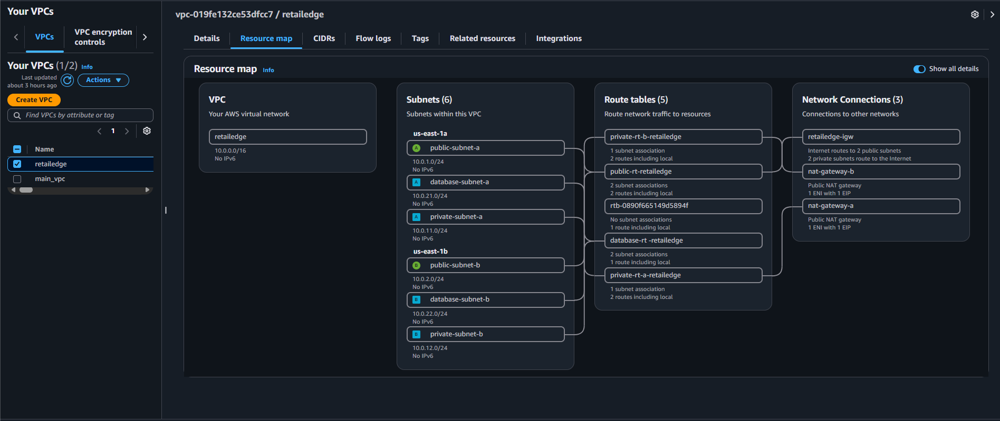
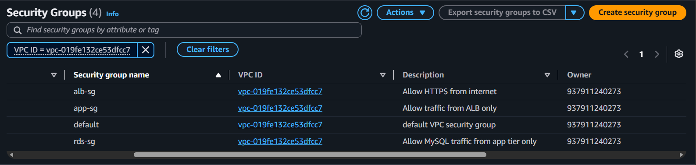

  # Layer 2 — Network Foundation & Security (Console Steps)

Manual steps performed in the AWS Console before writing the
equivalent Terraform code.

## Task 2.1 — VPC & Subnets

Created a VPC (10.0.0.0/16) with 6 subnets across 2 Availability Zones,
an Internet Gateway, 2 NAT Gateways (one per AZ), and 4 route tables
(public, private-a, private-b, database) to enforce tier isolation.

## Task 2.2 — Security Groups

Created 3 security groups forming a chained access pattern:

| Security Group | Allowed Source | Port |
|---|---|---|
| alb-sg | 0.0.0.0/0 (internet) | 443 |
| app-sg | alb-sg | 8080 |
| rds-sg | app-sg | 3306 |

## Task 2.3 — Answers

**Why does the Database subnet have no route to the Internet Gateway?**

Having no route is a network-level safeguard independent of security
group rules. Even if a security group were misconfigured, the database
subnet still has no path to or from the internet, since there is no
route to an Internet Gateway at all. The only access is from the
application tier over the private network, enforced further by the
rds-sg security group.

**What is the difference between Security Groups and NACLs?**

Security Groups attach to individual resources (like EC2 or RDS) and
are stateful — an allowed inbound request automatically allows its
response outbound. NACLs attach to subnets, are stateless (inbound and
outbound rules must both be defined separately), and support explicit
deny rules in addition to allow rules.
