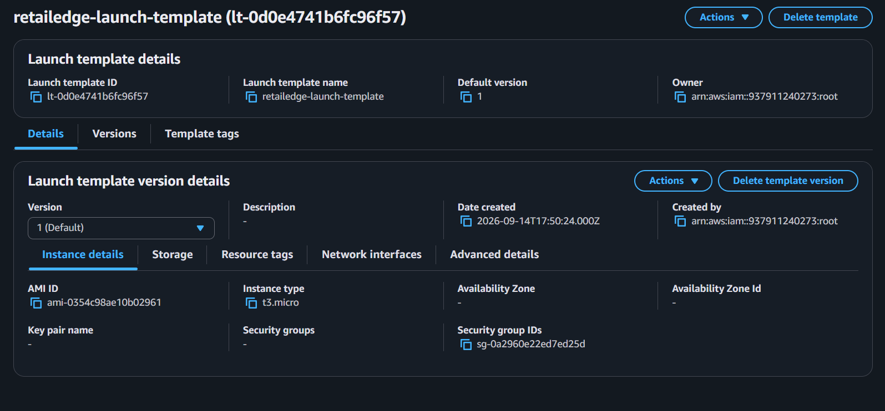
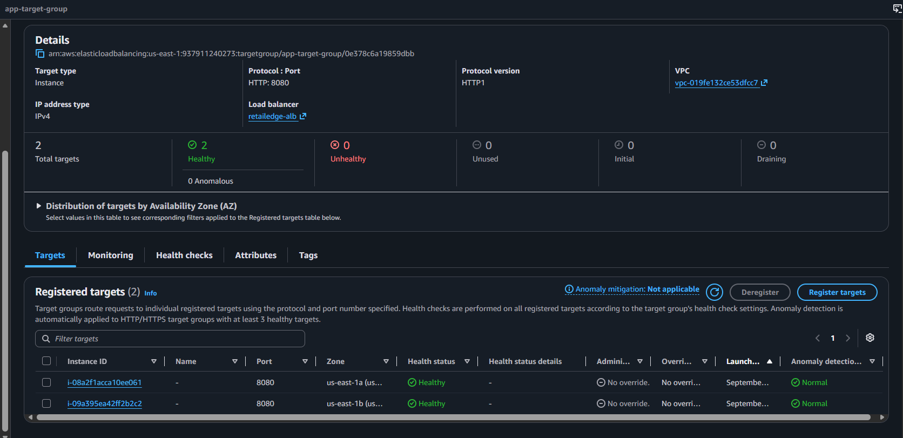
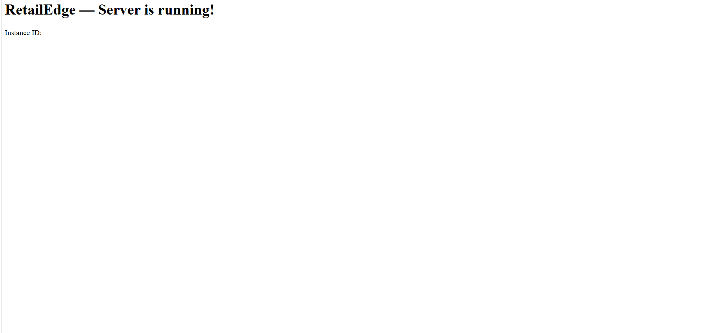

# Layer 3 — Compute & Auto Scaling (Console Steps)

Manual steps performed in the AWS Console before writing the
equivalent Terraform code.

## Task 3.1 — Launch Template

Created a launch template (`retailedge-launch-template`) using
Amazon Linux 2023, instance type t3.micro, and security group
`app-sg`. Added user data to install Apache and PHP, switch Apache
to listen on port 8080, and serve a simple PHP page that returns
the running instance's ID.

### Launch Template

## Task 3.1 (continued) — Application Load Balancer + Target Group

Created a target group (`app-target-group`) on port 8080 with an
HTTP health check on `/`. Created an Application Load Balancer
(`retailedge-alb`) in the public subnets, secured with `alb-sg`,
listening on port 80 and forwarding traffic to the target group.

## Task 3.1 (continued) — Auto Scaling Group

Created an Auto Scaling Group (`retailedge-asg`) from the launch
template, deployed across `private-subnet-a` and `private-subnet-b`,
attached to the ALB's target group, with desired=2, min=2, max=10,
and a 300-second health check grace period.

### Target Group — Both Instances Healthy

### Verifying the Site Works
Opened the ALB's DNS name in the browser and confirmed the PHP page
loads successfully, proving the network, security groups, and
compute layers all work together correctly.

## Task 3.2 — Scaling Policy

Created a target tracking scaling policy (`cpu-target-tracking`) on
Average CPU Utilization with a target value of 60%, allowing both
scale-out and scale-in so the group can shrink again once load drops.

## Task 3.3 — Answers

**What happens when CPU hits 60% on one instance, step by step?**

CloudWatch continuously monitors the average CPU utilization across
all running instances. Once the average stays above 60% for a
sustained period (not just a single spike), the target tracking
policy triggers the ASG to launch a new instance from the same
launch template.

**When does a new instance start receiving traffic, and why not
immediately?**

Only after the instance finishes its user data script (installing
Apache/PHP and starting the service) and passes the ALB's health
check during the health check grace period. Only then does the ALB
mark it Healthy and start routing traffic to it.

**Why did we choose min=2 instead of min=1?**

To guarantee availability across both Availability Zones. With
min=1, the single running instance could be in the AZ that fails,
taking the whole application down. With min=2 (one per AZ), the
other AZ keeps serving traffic if one AZ goes down.

## Task 3.4 (Bonus) — Scheduled Scaling

Created a scheduled action (`friday-evening-scale-up`) increasing
desired capacity to 6 every Friday at 8:00 PM UTC (`0 20 * * 5`),
to proactively prepare for weekend traffic spikes before they happen.
