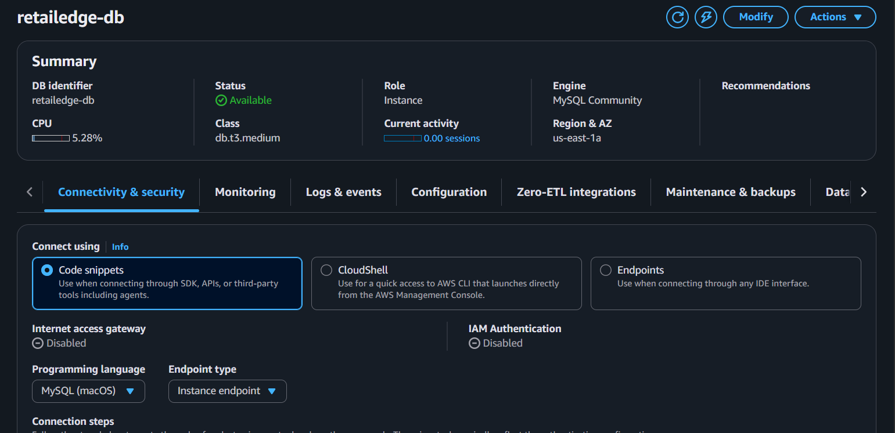
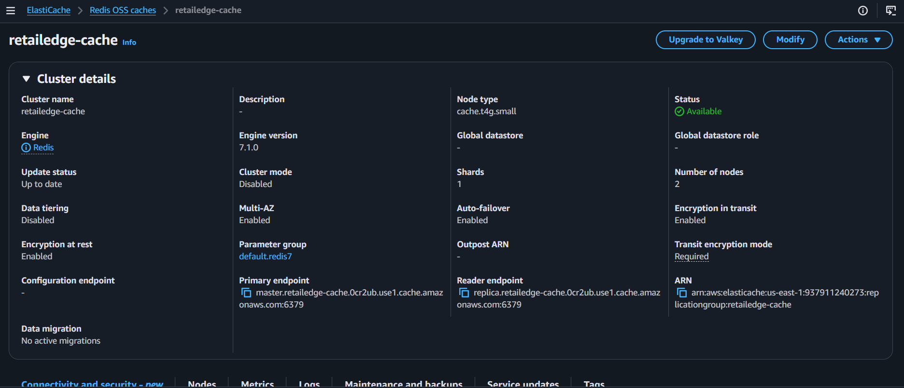

# Layer 4 — Data Layer & Migration (Console Steps)

## Task 4.1 — RDS Multi-AZ + ElastiCache

Created an RDS MySQL instance (`retailedge-db`) with Multi-AZ enabled
(primary in us-east-1a, secondary in us-east-1b), db.t3.medium,
100 GiB gp3 storage, storage encryption enabled, and 7-day backup
retention. Adjusted monitoring from Advanced to Standard Database
Insights to control cost.

Created an ElastiCache Redis cluster (`retailedge-cache`) with
cache.t4g.small nodes, 2 total nodes (1 primary + 1 replica),
Multi-AZ enabled, auto-failover enabled, and encryption enabled
both at-rest and in-transit.

## Task 4.3 — Answers

**What is the difference between RPO and RTO?**

RPO (Recovery Point Objective) is how much data, measured in time,
an organization can afford to lose in a failure — it answers "how
far back can our last good backup be?" RTO (Recovery Time Objective)
is how long the system can stay down before recovering — it answers
"how fast do we need to be back online?"

**Based on our configuration, what are the expected RPO and RTO
values?**

With RDS Multi-AZ using synchronous replication, RPO is close to
zero (seconds) since data is written to both the primary and
standby before a transaction is confirmed. RTO is typically under
2 minutes, since Multi-AZ failover is automatic and does not
require manual intervention.
